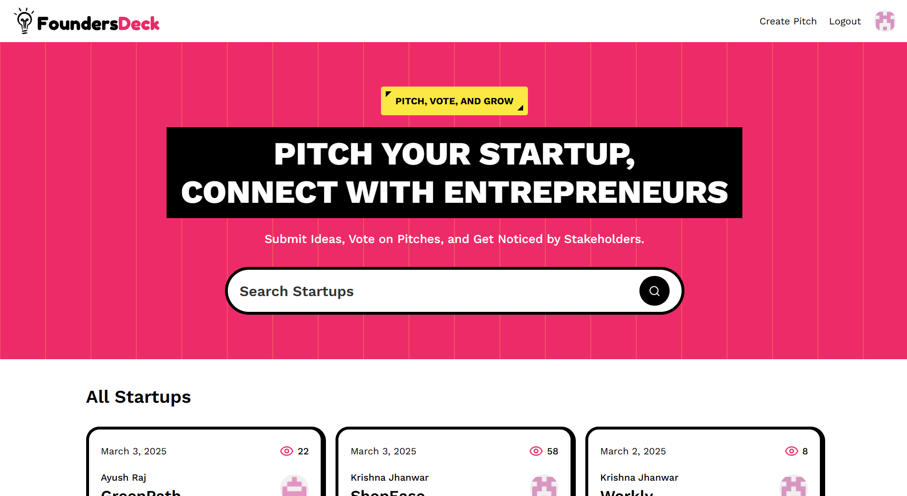
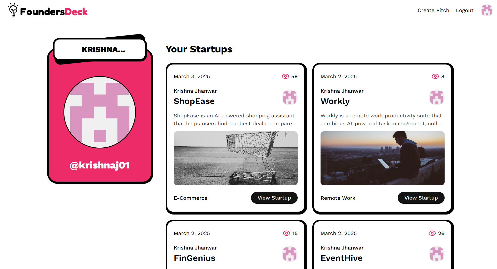
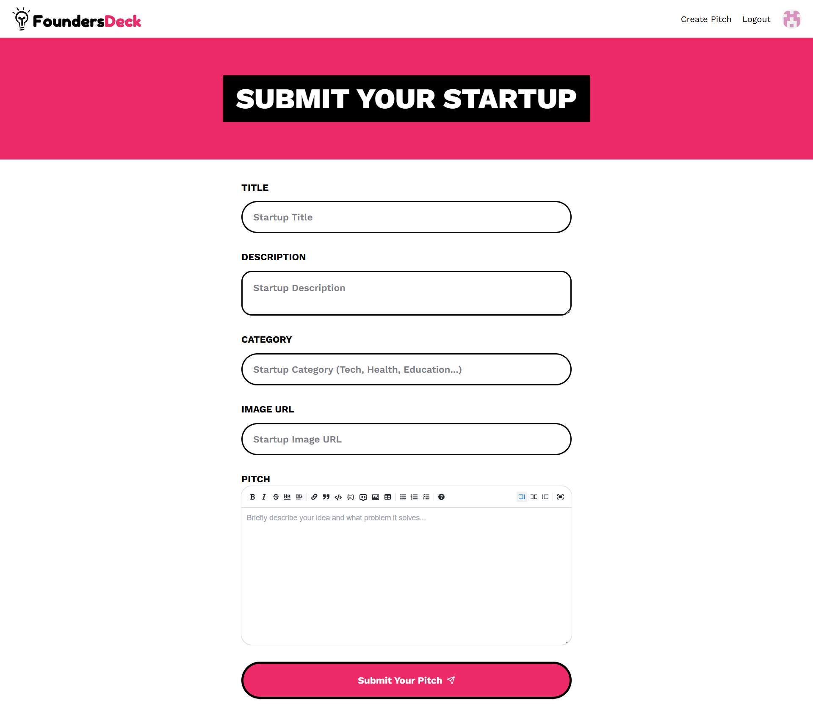

# FoundersDeck Platform
FoundersDeck is a platform where users can pitch their startup ideas and showcase their thoughts and works. It serves as a space for them to share their vision and explore ideas from various others.

## 🚀 Live Application
https://foundersdeck.vercel.app/

<div style="display: flex; align-items: center; justify-content: space-evenly; flex-wrap: wrap; gap: 1rem">
    
    
    
    
</div>

## 🎯 Key Learnings and Features

- Applied different **rendering strategies** such as **SSR (Server-Side Rendering)**, **PPR (Partial Pre-rendering)**, and **SSG (Static Site Generation)** based on the project requirements.

- Worked with **server and client components** in Next.js to optimize performance and user experience.

- Used **Sentry** to track and analyze website issues in a detailed manner, including crashes, errors, and performance bottlenecks.

## 🛠️ Tech Stack
- **Frontend:** Next.js, React.js, HTML5, CSS3, Tailwind CSS
- **Database:** Sanity (with basic GROQ query proficiency)
- **APIs:** GitHub OAuth, Sentry, RESTful API design
- **Hosting:** Vercel

## ⚙️ Setup and Installation

1. Clone the repository:
```bash
git clone https://github.com/krishnaj01/foundersdeck.git
```

2. Navigate to the project directory:
```bash
cd foundersdeck
```

3. Install dependencies:
```bash
npm install
```

4. Set up environment variables:
*(Create a .env file in the root directory and add the following)*

```
AUTH_SECRET=<your-auth-secret-key-for-authentication-sessions>
AUTH_GITHUB_ID=<your-auth-github-client-id>
AUTH_GITHUB_SECRET=<your-auth-github-client-secret>
NEXT_PUBLIC_SANITY_PROJECT_ID="xyd1z192"
NEXT_PUBLIC_SANITY_DATASET="production"
SANITY_WRITE_TOKEN=<your-sanity-write-token>
SENTRY_AUTH_TOKEN=<your-sentry-auth-token>
```

5. Run the development server:
```bash
npm run dev
```

6. Access the website locally at http://localhost:3000

## 📝 Contribution Guidelines
To contribute:
1. Fork the repository.
2. Create a new branch for your feature/bug fix.
3. Commit your changes with meaningful commit messages.
4. Push to your fork and submit a pull request.

## 📬 Contact
For any issues or suggestions, contact me at krishnaj@iitbhilai.ac.in